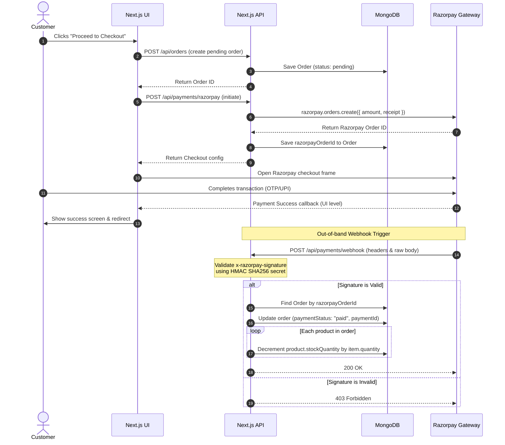

# Stitch Veda Ayurvedic Commerce System - Architectural Blueprint

This document outlines the technical architecture, data schemas, security boundaries, and payment integration flows for **Stitch Veda**, a responsive, mobile-first Ayurvedic e-commerce platform.

---

## 1. System & Technology Stack

The platform is designed to degrade elegantly on mobile devices (viewports < 768px) and leverage the following stack:

| Layer | Technology | Purpose |
| :--- | :--- | :--- |
| **Frontend** | Next.js 16 (App Router), Tailwind CSS v4, Lucide Icons | Responsive marketplace and backoffice dashboard layout |
| **Database** | MongoDB & Mongoose ORM | Document storage for users, catalog products, and orders |
| **Authentication** | NextAuth.js | Credentials provider (bcrypt) & Google OAuth 2.0 |
| **Media Storage** | Uploadthing | Optimized, cached storage for high-resolution herb images |
| **Payments** | Razorpay SDK & Webhooks | Payment processing and real-time inventory-sales sync |
| **Deployment** | Netlify | Host target, utilizing Next.js serverless functions |

---

## 2. MongoDB Database Schema Design

Three core collections are structured using Mongoose to ensure atomic operations, transaction-level consistency, and clean indexing:

### 2.1 Users Collection (`User`)
Stores account credentials, profile details, and role scopes.
```typescript
interface IUser {
  name: string;
  email: string;
  password?: string; // Hashed with bcrypt, optional for OAuth users
  role: "customer" | "factory" | "admin";
  createdAt: Date;
  updatedAt: Date;
}
```
* **Indexes:** Unique index on `email`.
* **Security:** `password` field uses `select: false` by default in queries to prevent accidental leakage.

### 2.2 Products Collection (`Product`)
Stores product catalog specs, inventory quantities, and Ayurvedic metadata.
```typescript
interface IProduct {
  name: string;
  description: string;
  price: number;
  stockQuantity: number;
  categories: string[];
  imageUrls: string[];
  metadata: {
    ingredients?: string[]; // Ayurvedic herb ingredients
    dosage?: string;        // Directions for usage
    benefits?: string[];    // Target wellness symptoms
    size?: string;          // Packaging size (e.g., "500g", "200ml")
  };
  createdAt: Date;
  updatedAt: Date;
}
```
* **Indexes:** Multi-key index on `categories` for fast filtering. Text index on `name` and `description` for keyword searching.

### 2.3 Orders Collection (`Order`)
Tracks transactional state, purchased items (snapshotted to preserve prices), and Razorpay tracking details.
```typescript
interface IOrderItem {
  product: Types.ObjectId;   // Ref to Product
  name: string;              // Snapshotted product name
  priceAtPurchase: number;   // Snapshotted price at time of purchase
  quantity: number;
}

interface IOrder {
  customer: Types.ObjectId;  // Ref to User
  products: IOrderItem[];
  totalAmount: number;
  razorpayOrderId?: string;  // Razorpay Order ID for verification
  razorpayPaymentId?: string;// Razorpay Payment ID for transaction records
  paymentStatus: "pending" | "paid" | "failed";
  shippingStatus: "pending" | "processing" | "shipped" | "delivered";
  shippingAddress: {
    street: string;
    city: string;
    state: string;
    zipCode: string;
    country: string;
  };
  createdAt: Date;
  updatedAt: Date;
}
```
* **Indexes:** Indexes on `customer`, `razorpayOrderId`, `paymentStatus`, and `shippingStatus` to optimize retrieval.

---

## 3. Role & Privilege Matrix

The system enforces strict role guards:

| Operation | Customer | Factory User | Administrator |
| :--- | :---: | :---: | :---: |
| **Browse Products** | Yes | Yes | Yes |
| **Checkout & Pay** | Yes | No | No |
| **View Own Orders** | Yes | N/A | N/A |
| **Edit Own Profile** | Yes | Yes | Yes |
| **View Incoming Orders Queue** | No | Yes | Yes |
| **Update Shipping Status** | No | Yes | Yes |
| **Modify Stock Levels (Inventory)**| No | Yes (Stock levels only) | Yes (All fields) |
| **CRUD Products Catalog** | No | No | Yes |
| **Auditing & Financial Metrics** | No | No | Yes |

---

## 4. Payment Gateway & Webhook Synchronization Flow

To prevent discrepancies (e.g., a customer paying but their order remaining "pending" or stock levels failing to update), the platform integrates a secure **Razorpay Webhook**.



---

## 5. API Endpoints Architecture

All API endpoints are located in `src/app/api/` and utilize Next.js Route Handlers:

### 5.1 Authentication Routes
* **POST `/api/auth/[...nextauth]`**
  * Handlers for NextAuth credentials check and Google OAuth login callbacks.

### 5.2 Product Management
* **GET `/api/products`**
  * Query parameters: `category` (filter by category), `search` (filter by name/description).
  * Access: Public.
* **POST `/api/products`**
  * Body: `{ name, description, price, stockQuantity, categories, imageUrls, metadata }`.
  * Access: Restricted to `admin` role.
* **PUT `/api/products/[id]`**
  * Body: Product fields.
  * Access: Restricted to `admin` and `factory` roles. 
  * *Constraint:* If role is `factory`, only `stockQuantity` updates are accepted. Other fields return 403 Forbidden.
* **DELETE `/api/products/[id]`**
  * Access: Restricted to `admin` role.

### 5.3 Order & Checkout Management
* **GET `/api/orders`**
  * Access: Authenticated users.
  * *Behavior:* Customers receive only their own history. Factory users and Admins receive all system orders.
* **POST `/api/orders`**
  * Body: `{ items: [{ productId, quantity }], shippingAddress: {...} }`.
  * Access: Authenticated customers.
  * *Behavior:* Verifies stock levels, snapshots pricing, and writes a pending order document.
* **PUT `/api/orders/[id]`**
  * Body: `{ shippingStatus }`.
  * Access: Restricted to `admin` and `factory` roles.

### 5.4 Payments Integration
* **POST `/api/payments/razorpay`**
  * Body: `{ orderId }`.
  * Access: Authenticated customers.
  * *Behavior:* Instantiates a Razorpay order entity and updates the Mongoose document.
* **POST `/api/payments/webhook`**
  * Headers: `x-razorpay-signature`.
  * Access: Public (secured by cryptographic HMAC signature validation).
  * *Behavior:* Syncs payment states and adjusts stock levels on successful checkout.

---

## 6. Atomic UI Component Hierarchy

The client architecture isolates styling tokens and base components from page views:

```
src/
├── components/
│   ├── ui/                <-- Atomic UI Elements (State-agnostic)
│   │   ├── Button.tsx     <-- Reusable primary, secondary, outline states
│   │   ├── Input.tsx      <-- Styled labels, error helpers
│   │   ├── Card.tsx       <-- Standard flex cards (header, content, footer)
│   │   ├── Badge.tsx      <-- Custom indicators for roles/shipping/payments
│   │   ├── Select.tsx     <-- Form dropdown selectors
│   │   └── Table.tsx      <-- Responsive table grid system
│   │
│   ├── layout/            <-- Page templates and structure
│   │   └── Navbar.tsx     <-- Responsive header with mobile drawer
│   │
│   ├── marketplace/       <-- Storefront Components
│   │   ├── ProductCard.tsx
│   │   ├── CartDrawer.tsx
│   │   └── OrderTracker.tsx
│   │
│   └── dashboard/         <-- Admin & Factory Views
│       ├── InventoryTable.tsx
│       ├── OrderManager.tsx
│       └── AdminMetrics.tsx
```

---

## 7. Netlify Deployment Checklist

To deploy the Stitch Veda application on Netlify:
1. **Next.js Runtime:** Netlify automatically detects Next.js App Router and provisions serverless functions for Route Handlers (`/api/*`).
2. **Environment Variables:** Define all variables listed in `.env.example` in the Netlify Site Settings.
3. **Database Connection String:** Whitelist Netlify's build/runtime IP ranges in MongoDB Atlas, or enable "Allow Access from Anywhere" (`0.0.0.0/0`) since serverless functions have dynamic IPs.
4. **Razorpay Webhooks:** Point your Razorpay Dashboard Webhook URL to:
   `https://your-netlify-domain.netlify.app/api/payments/webhook`
   And copy the Webhook Secret to `RAZORPAY_WEBHOOK_SECRET` in your environment config.
